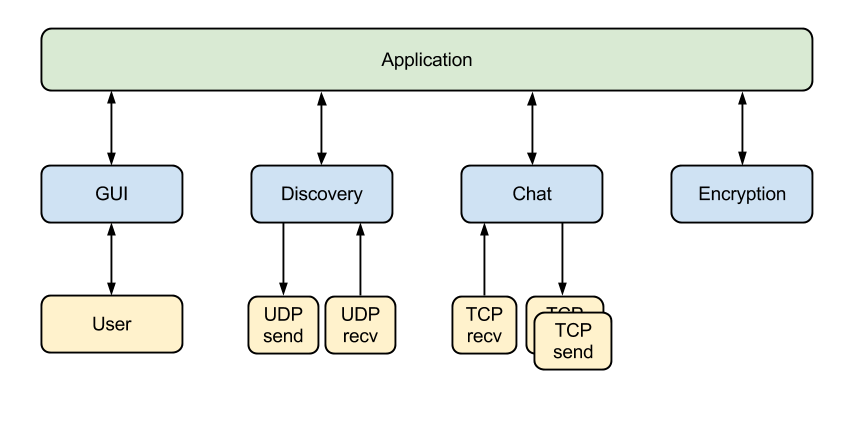

Introduction
============

The goal of this educational project was to create a distributed (decentralized,
peer-to-peer, server independent) chat system for iPad that would work in any
Wifi network. The chat uses discovery protocol to locate other users and
messages are sent to all clients like in a chat room.  Furthermore the
transmission of messages is encrypted with RSA small keys.

<table>
  <tr>
    <th>Note: Part of this documentation is written in German.</th>
  </tr>
</table>

Credits
=======

This project is the result of the seminar computer networks of the Institute of
Communications Engineering in the University of Ulm, which took place under the
tuition of [Joao Carneiro](mailto:joao.flavio@gmail.com), [Florian
Pregizer](mailto:florian.pregizer@uni-ulm.de) and [Prof. Dr. Hans Peter
Großmann](mailto:hans-peter.grossmann@uni-ulm.de).

General Implementation
======================

Every student got a module that they should program. Click on student name to
send him an email.

 Module name          | Student                                                | Classes
 -------------------- | ------------------------------------------------------ | ------------------------------------------
 Chat                 | [Joao Carneiro](mailto:joao.flavio@gmail.com)          | Chat
 Encryption           | [Alexander Skoric](mailto:alexander.skoric@uni-ulm.de) | Verschluesselung
 Discovery            | [Markus Rampp](mailto:markus.rampp@uni-ulm.de)         | Devices
 User interface (GUI) | [Alexander Sauer](mailto:alexander.sauer@uni-ulm.de)   | DetailViewController, MasterViewController
 Application          | [Alexander Sauer](mailto:alexander.sauer@uni-ulm.de)   | AppDelegate
 Network base         | [Joao Carneiro](mailto:joao.flavio@gmail.com)          | TcpOperation, UDP, Block

The modules are connected to each other in this way:

The class Application is responsible for organizing the intercommunication
between the classes, it initiates the instances of the blue classes and store
their address as property. In the initialisation the objects, they received the
address of AppDelegate.

User interface
--------------

It is responsible for presenting messages, error and configurations like
user's name.

Discovery
---------

To know how is around in the same network a discovery system was implemented
using broadcast UDP packets. In this way it is possible to present a list of
currently present clients to the user.

Chat
----

It sends and receives the messages packing them in a encrypted protocol. All
messages are sent to all currently present clients.

Encryption
----------

It is responsible for generating RSA key pairs for the device, encryption and
decryption of messages.

License
=======

<table style="background-color=white;" >
  <tr>
    <th width="100" >
      
    </th>
    <th>
      Distributed Chat by
      <a href="http://www.uni-ulm.de/in/nt/staff/research-assistants/pregizer.html" rel="cc:attributionURL">
        University of Ulm's Institute of Communications Engineering</a>
      is licensed under a
      <a rel="license" href="http://creativecommons.org/licenses/by-nc-sa/3.0/deed.en_US">
        Creative Commons Attribution-NonCommercial-ShareAlike 3.0 Unported License
      </a>.
    </th>
  </tr>
</table>
